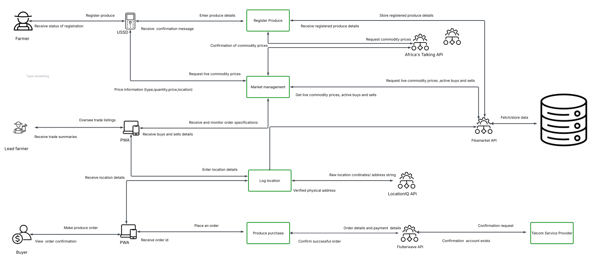
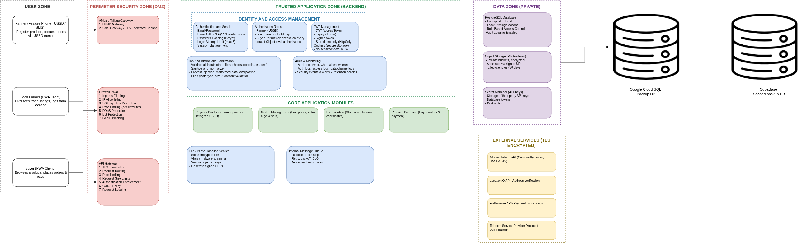

# FIKAMARKET ARCHITECTURE 

## Client Interfaces
FikaMarket delivers optimized interfaces tailored for each user role to account for different access requirements and hardware capabilities. Farmers list their crop yields, review prevailing commodity rates, and track system status updates strictly via a structured USSD interface. Lead Farmers monitor processing queues, log active collection point metadata, and authenticate on-site item handovers using a central administrative dashboard. Buyers search available marketplace catalog items, schedule specific delivery volumes, and execute financial clearings directly inside a dedicated mobile application.

## System Security Architecture
The platform implements structural security frameworks designed to safeguard financial transactions, isolate operational user profiles, and secure edge network communication. This architecture governs access control across client portals and establishes encryption boundaries between core backend systems and external integrations.

## Backend Architecture
The core system relies on a unified FikaMarket API layer that bridges consumer clients with backend database storage engines and external software vendors. This application code is structured into four isolated operational modules.

### Register Produce
This component processes inbound network payloads originating from user sessions to log crop categories and volume attributes securely.

### Market Management
This service computes active marketplace metrics, calculates volume matching parameters, and surfaces historical or ongoing pricing metrics.

### Log Location
This utility processes spatial geometry coordinates to map and authorize valid transit endpoints for physical logistical fulfillment.

### Produce Purchase
This engine evaluates checkout requests, creates order sequences, and establishes conditional transaction state pipelines.

## External Integrations

### Africa’s Talking API
This gateway handles high-volume communication pipelines alongside routing updates regarding structural commodity price trends.

### LocationIQ API
This microservice transforms raw spatial variables to retrieve, map, and authenticate valid logistical coordination regions.

### Flutterwave API
This clearing house handles transactional pipelines, holding processing funds securely until conditional platform workflow states clear.

### Telecom Service Provider
This telecommunication bridge delivers underlying routing architecture to handle real-time session workflows for mobile clients.

## Data Flow

### 1. Registration
The initialization loop triggers when a user submits details through a network gateway, prompting the system to generate associated entity records.

### 2. Produce Submission
The cataloging workflow maps a crop entry to an established distribution spot, requiring validation checks before publishing the final listing.

### 3. Order Creation
The customer funnel translates browse actions into explicit purchase orders linked directly to chosen delivery times and verified coordinates.

### 4. Payment
The checkout pipeline captures payment authorization, locks the settlement capital in an escrow state, and runs validation checks on the matching account.

### 5. Collection
The logistical phase tracks physical drop-offs at designated transit spots where platform managers perform manual inventory and confirmation audits.

### 6. Escrow Release
The final accounting settlement executes instantly upon delivery confirmation, clearing the locked escrow balance to the supplier while generating a ledger receipt.

### 7. Notifications
The logging sub-system captures vital step changes across the order lifecycle and broadcast-routes text notifications directly to target entities.

### 8. Transaction History
The ledger service appends every verified order lifecycle closure directly onto an immutable chronological history file for financial logging.