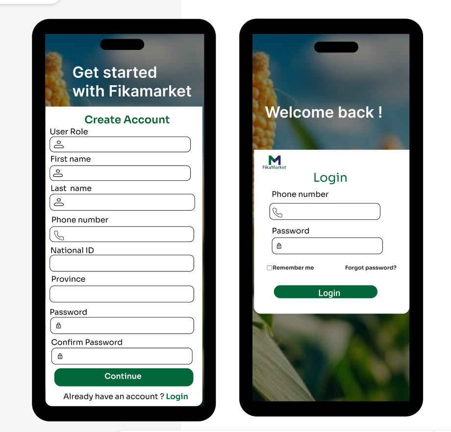
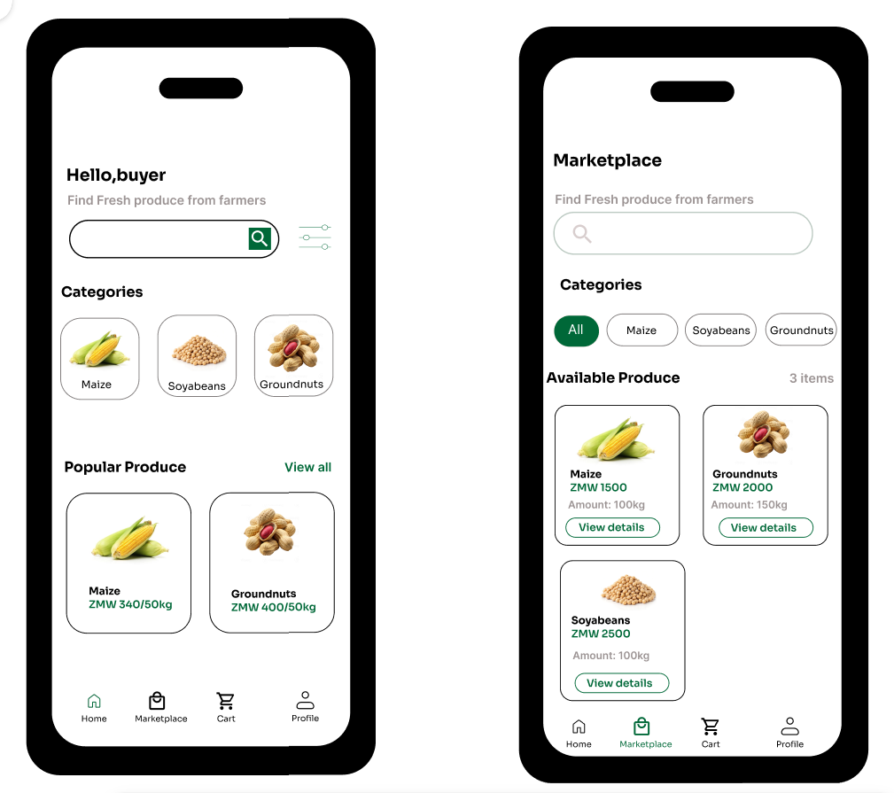
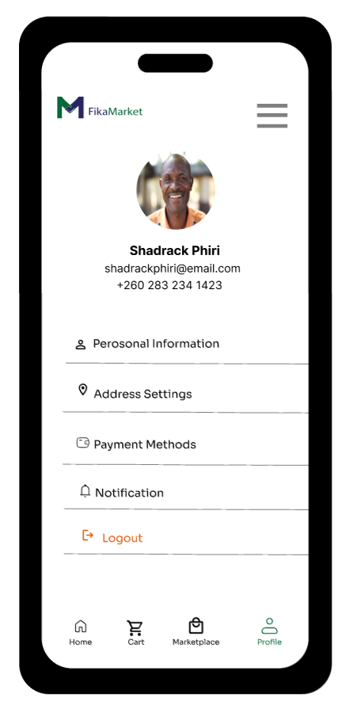

# Frontend Mobile

## 1. Overview
The **FikaMarket** mobile application is a **Flutter-based smartphone application tailored for buyers**. 


### Target Audience & Core Capabilities


Buyers use this application to execute the following core workflows:
* Register and log in secure user accounts
* Browse available fresh agricultural produce
* Add items seamlessly to their digital cart
* Place orders and track delivery states
* Manage buyer profiles and historical data
* Request real-time customer and system help

!!! note "Farmer Connectivity & System Inclusivity"
    **Farmers do not use this mobile application.** Farmers with feature phones interact with the FikaMarket ecosystem via **USSD channels**. This bypasses internet infrastructure constraints to ensure maximum regional accessibility.

---

## 2. Tech Stack Matrix

| Component | Technology | Role / Execution Detail |
| :--- | :--- | :--- |
| **Framework** | Flutter | Cross-platform UI layout engine and widget orchestration |
| **Language** | Dart | Native strongly-typed execution and layout scripting |
| **Platform** | Android / iOS | Target compilation platforms for user smartphones |
| **Backend API** | FastAPI | High-performance Python REST API layer handling logic |
| **Database** | PostgreSQL | Relational transactional engine storing state data |

---

## 3. Project Directory Map

Below is the verified project directory layout mapping out where the core client application modules reside.

```text
Fikamarket/
├── .dart_tool/                  # Internal build cache & localized compilation scripts
├── android/                     # Android native entry project files, manifests, and build flavors
├── assets/                      # Static resource bundles (Images, local icons, Custom Fonts)
│   └── design_mockups/          # Root directory for storing interface layouts and screenshot files
├── build/                       # Binaries, apks, and bundles compiled during generation
├── ios/                         # iOS native runner, schemes, and provisioning entitlements
├── linux/                       # Native desktop Linux packaging configuration files
├── macos/                       # Native macOS desktop pipeline infrastructure
├── web/                         # Browser responsive application delivery bundles
├── windows/                     # Native Windows desktop application configurations
├── lib/                         # Active developer project workspace (Dart Source Code)
│   ├── models/                  # Core local models mapping payload schemas
│   │   ├── cart_model.dart             # Localized state engine for shopping cart mutations
│   │   ├── product_item.dart           # Property definitions for marketplace produce items
│   │   └── user_profile.dart           # Structural properties defining verified buyers
│   ├── screens/                 # Target user presentation and interaction layouts
│   │   ├── buyer_profile_screen.dart   # Interactive profile rendering and update fields
│   │   ├── help_form_screen.dart       # Customer support ticket submittal form view
│   │   ├── home_screen.dart            # Standard splash dashboard and welcome feed
│   │   ├── signup_screen.dart          # New buyer account onboarding system flow
│   │   ├── login_screen.dart           # Authentication input fields and gateway validation
│   │   ├── main_navigation_screen.dart # Core routing shell holding persisting bottom tabs
│   │   ├── market_place.dart           # Dynamic item listings feed grid layout
│   │   └── personal_information_screen.dart # Personal identity update interfaces
│   ├── services/                # Backend API abstraction hooks and HTTP data consumers
│   └── main.dart                # Global initial execution setup and application loop runner
├── .gitignore                   # Specified items excluded from standard source version control
├── .metadata                    # Automatically managed Flutter tracking parameter data
├── analysis_options.yaml        # Code style configuration lint rules
├── pubspec.lock                 # Explicit snapshots specifying absolute dependent versions
├── pubspec.yaml                 # Active manifest listing third-party asset libraries
└── README.md                    # Basic markdown landing instructions document
```

---

## 4. Architecture Layers

The FikaMarket client code relies on three main architecture levels to guarantee a clean separation of concerns:

| Layer | Primary Engineering Purpose |
| :--- | :--- |
| **Models** | Formulates app-wide data payloads (such as products, users, and shopping carts) into strongly typed entities. |
| **Screens** | Contains the presentational layout widgets providing the active user interface for buyers. |
| **Services** | Executes explicit network API request payloads out to the FikaMarket centralized cloud infrastructure. |

### System Execution Workflow Dataflow
```text
      [ Buyer UI Interaction ]
                 ↓
       Flutter Mobile App Screens
                 ↓
       Data Services Layer (REST API)
                 ↓
         FikaMarket FastAPI
                 ↓
       Central PostgreSQL Database
```

---

## 5. Core Interface Components & UI Layout Designs

Here is how the application layout translates into code modules, alongside live mobile design previews.

###  5.1 Account Onboarding & Security Gateway
* **Routing Shell:** Controlled globally inside `main_navigation_screen.dart`. It hosts the core scaffold layout and controls bottom navigation tabs.
* **Authentication Modules:** Handled safely across `login_screen.dart` and `signup_screen.dart`.


    
    


<div style="clear: both;"></div>

###  5.2 Home page & Marketplace Browsing

* **Buyer Portal View:** This is the main screen the buyer sees after logging in.
* **Marketplace Discovery Grid:** Buyers browse and query active produce items using `market_place.dart`.

     

<div style="clear: both;"></div>

###  5.3 Buyer Account Profile & Help Desk
* **Profile Management:** Split across `buyer_profile_screen.dart` and `personal_information_screen.dart` to separate preferences from core account records.


   

<div style="clear: both;"></div>

---

## 6. Secure Infrastructure Standards

The client application connects securely via API layers and **never accesses the transactional database engines directly**.

* **User Authentication:** Enforces explicit state check validations.
* **Local Security Scaffolds:** Stores active secure tokens using low-level device security primitives (Keychain on iOS and Keystore on Android engines).
* **Sanitized Inputs:** Strips problematic characters during string evaluation to neutralize execution injection threats.
* **Encrypted API Payload Handshakes:** Leverages HTTPS and SSL parameters to prevent traffic eavesdropping.

*For complete infrastructural analysis, review the official [Security Architecture Document](https://drive.google.com/file/d/1qeOpj85cGDaxafPCQVPepJ8V51C2uLMO/view?usp=sharing).*

---

## 7. Operational Onboarding Setup

### Prerequisites Verification
* Stable deployment of the **Flutter SDK**
* **Dart Runtime Framework** environment pathings
* **Git** version management core CLI tools
* Initialized installation of **Android Studio** (with an active virtual emulator machine) or Apple **Xcode**

### Initial Local Project Construction
```bash
# Step 1: Clone the active source management tracking repository
git clone <repository-url>

# Step 2: Navigate inside your local project home workspace root
cd fikamarket

# Step 3: Fetch structural configuration updates and runtime libraries
flutter pub get

# Step 4: Run configuration framework sanity checking validation
flutter doctor

# Step 5: Initialize the local debugging application inside your active emulator target
flutter run
```

---

## 8. Development Troubleshooting

| Identified Breakage | Root Resolution Path |
| :--- | :--- |
| Dependent libraries fail to compile | Force an updating structural fetch by executing `flutter pub get` via shell |
| Flutter environment errors out | Execute `flutter doctor` to find missing toolchain components or paths |
| Backend network API payload fails | Confirm connectivity parameters, base address paths, and FastAPI health states |
| Device virtualization emulator misses initialization | Check virtualization engine settings and disk parameters in Android Studio/Xcode |


## 9. Channel Pipelines: Farmer USSD

Farmers utilizing basic **feature phones** don't download the Flutter code project. Instead, their cellular endpoints use automated **USSD service lines**, ensuring operational reliability even on simple networks.

```text
Farmer (Feature Phone)
          ↓
USSD Protocol Broadcast
          ↓
Africa's Talking Gateway Routing
          ↓
FikaMarket FastAPI Engine
          ↓
Central Production Database
```

### How the USSD Code Works
1. **Dialing:** The farmer dials a unique shortcode (`*384#`) on their feature phone.
2. **Gateway:** The mobile phone network sends this request to the **Africa's Talking Gateway**.
3. **API Call:** The gateway converts the request and sends a standard HTTP message to our **FastAPI Backend**.
4. **Database:** The backend saves or reads the crop data from our **PostgreSQL Database** and sends a text menu back to the farmer.

###  USSD Screen Flow
Here is what the farmer sees on their screen when they use the service:

**Main Menu:**
```text
Welcome to FikaMarket!
1. Register as Farmer
2. Sell My Produce
3. Check Market prices
4. Get Help
```

**After Selecting Option 2 (Sell My Produce):**
```text
Select Crop Type:
1. Maize
2. Soyabeans
3. Groundnuts
```

**After Selecting Option 1 (Maize):**
```text
Enter quantity in 50kg bags:
[ User types: 20 ]
```
