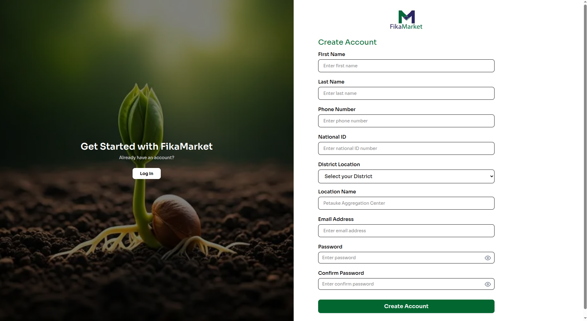
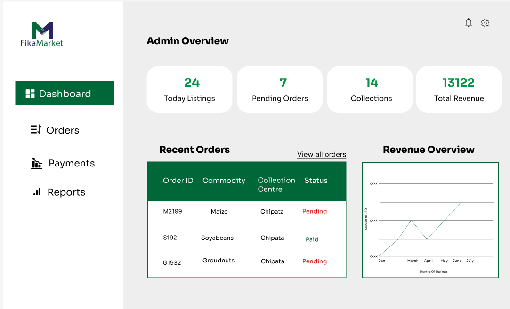

# Frontend Web

## Lead Farmer Dashboard

### Introduction

The Lead Farmer Dashboard is the web client used by Lead Farmers to oversee collection points, monitor active buys and sells, and verify produce handovers. It is built with `Next.js` and `React`, and communicates with the FikaMarket API for all data operations.

The dashboard is optimized for desktop use, since Lead Farmers typically manage collection point activity from a fixed location rather than in the field.

### Technology Stack

| Category | Technology | Purpose |
|---|---|---|
| Framework | Next.js 16.3.1 | React framework with App Router |
| UI Library | React / React-DOM 19.2.8 | Component rendering |
| Styling | Tailwind CSS / PostCSS ^4 | Utility-first CSS |
| Forms | React Hook Form | Form state and validation |
| Charts | Recharts | Revenue and order data visualization |
| Icons | Lucide React | Icon set |
| Typography | Roboto | Base font |
| Auth | JWT | Session and role verification |
|Formatting | ESLint + Prettier | Code quality and formatting |
| Hosting | Vercel | Production deployment |

### Prerequisites

Before setting up the dashboard, ensure the following are installed

| Tool | Version | Purpose |
|---|---|---|
| Node.js | 18.x or later | JavaScript runtime |
| npm | 9.x or later | Package manager |
| Git | Latest | Version control |

**Install Node.js on Linux**

```bash
curl -fsSL https://deb.nodesource.com/setup_18.x | sudo -E bash -
sudo apt install -y nodejs
node --version
npm --version
```


**Install Node.js on Windows**

```powershell
powershell -c "irm https://community.chocolatey.org/install.ps1%7Ciex"
choco install nodejs
node --version
npm --version
```

**Install Node.js on macOS**

```bash
brew install node
node --version
npm --version
```


### Setup and Installation

**1. Clone the repository**

```bash
git clone https://github.com/your-organisation/fikamarket.git
cd fikamarket/frontend
```

**2. Install dependencies**

```bash
npm install
```

This installs Next.js, React, Tailwind CSS, React Hook Form, Recharts, and Lucide React. This may take a few minutes depending on  your connection speed.

**3. Configure environment variables**

Create a `.env.local` file in the `frontend/` directory:

```text
# Required - backend API base URL
NEXT_PUBLIC_API_URL=https://your-backend-url/api/v1
```

**4. Start the development server**

```bash
npm run dev
```


##UI Overview

Once the command is run, the first page you will see is the login and signup page, followed by the dashboard.


**Login**


**Signup**



**Dashboard**




This app is hosted at `https://cipher-dashboard-ten.vercel.app` .

[View dashboard](https://cipher-dashboard-ten.vercel.app){ .md-button target="_blank" rel="noopener" }


**package.json scripts**

```json
{
  "name": "fikamarket_dashboard",
  "version": "0.1.0",
  "private": true,
  "scripts": {
    "dev": "next dev",
    "build": "next build",
    "start": "next start",
    "lint": "eslint"
  },
  "dependencies": {
    "lucide-react": "^1.31.0",
    "next": "16.3.1",
    "react": "19.2.8",
    "react-dom": "19.2.8"
  },
  "devDependencies": {
    "@tailwindcss/postcss": "^4",
    "@types/node": "^20",
    "@types/react": "^19",
    "@types/react-dom": "^19",
    "eslint": "^9",
    "eslint-config-next": "16.3.1",
    "tailwindcss": "^4",
    "typescript": "^5"
  }
}
```

### Project Structure

```
fikamarket/
+-- app/
|   +-- components/       Global reusable layout components and visual blocks
|   +-- login/            Authentication logic and input forms
|   |   +-- page.js
|   +-- signup/           User onboarding setup views
|   |   +-- page.js
|   +-- dashboard/        Core analytical layout displaying Recharts blocks
|   |   +-- page.js
|   +-- orders/           Fulfillment tables and processing lists
|   |   +-- page.js
|   +-- payments/         Financial status sheets and transaction columns
|   |   +-- page.js
|   |   +-- page.module.css
|   +-- reports/          Regional yield print sheets and metrics
|   |   +-- page.js
|   +-- public/           Production-ready static image directories
|   |   +-- fikamarket_logo.png
|   +-- global.css        Root Tailwind styles
|   +-- layout.js         Top-level application layout wrapper
|   +-- page.js            Index entry route
|   +-- page.module.css    Page styling
+-- node_modules/
+-- .gitignore
+-- eslint.config.mjs
+-- next.config.ts
+-- package.json
+-- package lock.json
+-- postcss.config.mjs
+-- README.md
```

### Coding Standards and Conventions

**Naming conventions**

| Element | Convention | Example |
|---|---|---|
| Components | PascalCase | `ProduceCard.js` |
| Functions & variables | camelCase | `fetchData()`, `isLoading` |
| Tailwind classes | lowercase | `className="gap-4"` |
| Files & pages | kebab-case | `dashboard-charts` |
| Constants | UPPER_SNAKE_CASE | `BASE_URL` |

**File organization**

| Folder | Purpose |
|---|---|
| `components/` | Reusable UI components |
| `login/`, `signup/` | Authentication and onboarding |
| `dashboard/` | Marketplace overview and analytics |
| `orders/` | Produce order management |
| `payments/` | Transaction and payment records |
| `reports/` | Purchase metrics and reports |
| `public/` | Static asset storage |
| `global.css` | App wide style definitions |

### Role-Based Routing

Access to the dashboard is scoped to a single role the `lead_farmer` role. On login, the frontend sends credentials to the FikaMarket API and receives a JWT. The role encoded in the token is checked before granting access to dashboard routes.

```text
User Login
     |
Authentication API
     |
  JWT returned
     |
Decode user role
     |
lead_farmer -> Dashboard access
```

### Authentication Flow

The frontend sends login credentials to the FikaMarket API. On success, the API returns a JWT containing the user's role, token expiry, and user ID. The token is stored on the client side and it is  used to authorize subsequent requests.

```text
     User
      |
Enter credentials
      |
   Login Page
      |
POST credentials
      |
Authentication API
      |
 +----+----+
 |         |
Invalid   Valid
 |         |
Error    JWT Token
message    |
        Session Storage
           |
      Dashboard Access
```

**Token storage**

| Storage | Purpose |
|---|---|
| Cookies |  On the server side auth for middleware protected routes |
| sessionStorage | Temporary session data |
| localStorage | Persists auth across page refreshes |

**Auth helpers**

```text
login()
logout()
getToken()
isAuthenticated()
getCurrentUser()
getUserRole()
isTokenExpired()
```

```js
export function isAuthenticated() {
  const token = getToken();
  return Boolean(token);
}
```

**Token payload**

```json
{
  "sub": "user-uuid",
  "role": "lead_farmer",
  "exp": 17645385500
}
```

| Field | Description |
|---|---|
| `sub` | Unique ID of the authenticated user |
| `role` | User's application role |
| `exp` | JWT expiration timestamp |

### API Integration

Next.js API routes proxy requests to the FikaMarket backend, keeping the backend URL server side.

```js

import { NextResponse } from 'next/server';

export async function POST(request) {
  try {
    const body = await request.json();
    const backendUrl = process.env.NEXT_PUBLIC_API_URL;

    const backendResponse = await fetch(`${backendUrl}/users/login`, {
      method: 'POST',
      headers: { 'Content-Type': 'application/json' },
      body: JSON.stringify(body),
    });

    const data = await backendResponse.json();
    return NextResponse.json(data, { status: backendResponse.status });
  } catch (error) {
    return NextResponse.json({ message: 'Internal Server Error' }, { status: 500 });
  }
}
```

```js

import { NextResponse } from 'next/server';

export async function POST(request) {
  try {
    const body = await request.json();
    const backendUrl = process.env.NEXT_PUBLIC_API_URL;

    const backendResponse = await fetch(`${backendUrl}/users/`, {
      method: 'POST',
      headers: { 'Content-Type': 'application/json' },
      body: JSON.stringify(body),
    });

    const data = await backendResponse.json();
    return NextResponse.json(data, { status: backendResponse.status });
  } catch (error) {
    return NextResponse.json({ message: 'Internal Server Error' }, { status: 500 });
  }
}
```

frontend.md2
**API client**

A shared client wraps `fetch` calls with automatic auth header injection and consistent error handling, this ia so individual pages do not repeat that logic.

```js

const API_BASE = process.env.NEXT_PUBLIC_API_URL || "";

function buildUrl(path) {
  return `${API_BASE}${path}`;
}

function getAuthHeaders() {
  const token =
    typeof window !== "undefined" ? localStorage.getItem("fikamarket_token") : null;
  const headers = { "Content-Type": "application/json" };
  if (token) {
    headers["Authorization"] = `Bearer ${token}`;
  }
  return headers;
}

export async function apiGet(path) {
  const res = await fetch(buildUrl(path), { headers: getAuthHeaders() });
  if (!res.ok) throw new Error(`Request failed (${res.status})`);
  return res.json();
}

export async function apiPost(path, body) {
  const res = await fetch(buildUrl(path), {
    method: "POST",
    headers: getAuthHeaders(),
    body: JSON.stringify(body),
  });
  if (!res.ok) throw new Error(`Request failed (${res.status})`);
  return res.json();
}
```

**Service files**

Requests are grouped by resource, this is so each file owns one part of the backend surface.

| File | Endpoint | Handles |
|---|---|---|
| `lib/api/listings.js` | `/produce-listings/` | Fetching and managing produce listings |
| `lib/api/orders.js` | `/orders/` | Order lookup and status updates |
| `lib/api/payments.js` | `/payments/` | Transaction records |
| `lib/api/collection-points.js` | `/collection-points/` | Collection point details |

```js

import { apiGet, apiPost } from "./client";

export async function getOrders() {
  return apiGet("/orders/");
}

export async function getOrderById(orderId) {
  return apiGet(`/orders/${orderId}`);
}

export async function confirmHandover(orderId, data) {
  return apiPost(`/orders/${orderId}/confirm`, data);
}
```

### Login & Signup Pages

The login page collects the phone number and password, submits them to `/api/login`, stores the returned token, and redirects to `/dashboard` on success. An error message displays on failed attempts.

The signup page collects the Lead Farmer's name, email, phone, and assigned collection point, then submits to `/api/signup`. Password fields validate for minimum length before submission is allowed.

### Forgot & Reset Password

The forgot password page collects an email address and requests a reset link from `/api/users/forgot-password`. On success, a confirmation message displays on the page, it does not reveal whether the email exists, to avoid leaking account information.

The reset password page reads a token from the URL query string, collects a new password with confirmation, and submits both to the backend for validation.

```js
async function handleSubmit(email) {
  const data = await apiPost("/users/forgot-password", { email });
  return data.message || "Check your email for a reset link.";
}
```

### Shared Components

Reusable pieces used across dashboard pages:

| Component | Purpose |
|---|---|
| `Button.js` | Primary/secondary/danger button variants with a loading state |
| `Input.js` | Labeled text input with inline error display |
| `LoadingScreen.js` | Full page loading overlay |
| `Sidebar.js` | Navigation for all desktop screens |

```js

export default function Button({
  children,
  variant = "primary",
  isLoading = false,
  disabled,
  ...props
}) {
  const variantStyles = {
    primary: "bg-[#006838] hover:bg-[#004D29] text-white",
    secondary: "bg-gray-200 hover:bg-gray-300 text-gray-800",
    danger: "bg-red-600 hover:bg-red-700 text-white",
  };

  return (
    <button
      className={`rounded-lg px-4 py-2 font-semibold transition ${variantStyles[variant]}`}
      disabled={disabled || isLoading}
      {...props}
    >
      {isLoading ? "Loading..." : children}
    </button>
  );
}
```

### Styling

Tailwind CSS is configured with FikaMarket's brand palette rather than the framework defaults.

```js

module.exports = {
  content: ["./app/**/*.{js,jsx}", "./components/**/*.{js,jsx}"],
  theme: {
    extend: {
      colors: {
        green: {
          600: "#006838",
          700: "#004D29",
        },
        navy: {
          600: "#262262",
        },
      },
      fontFamily: {
        sans: ["Roboto", "system-ui", "sans-serif"],
      },
    },
  },
};
```

| Token | Value | Usage |
|---|---|---|
| Primary | `#006838` | Buttons, active nav links |
| Primary Dark | `#004d29` | Hover states |
| Accent | `#262262` | Header bar, section dividers |
| Text Primary | `#111827` | Headings |
| Text Secondary | `#6b7280` | Body copy |

### Charts

The `dashboard/` page renders order and revenue trends using Recharts, pulling data from the orders and payments endpoints and rendering a responsive line/bar chart sized to the container.

### Error Handling

API failures surface consistently: the shared client throws on a non OK response, and calling pages catch that error to show an inline message or retry button rather than a blank screen.

```js

import React from "react";

export class ErrorBoundary extends React.Component {
  constructor(props) {
    super(props);
    this.state = { hasError: false };
  }

  static getDerivedStateFromError() {
    return { hasError: true };
  }

  render() {
    if (this.state.hasError) {
      return (
        <div className="p-6 text-center">
          <p className="text-gray-600">Something went wrong, try again later.</p>
          <button
            onClick={() => window.location.reload()}
            className="mt-4 rounded-lg bg-[#006838] px-4 py-2 text-white"
          >
            Reload
          </button>
        </div>
      );
    }
    return this.props.children;
  }
}

**Regression checks**

Before each release, existing flows are reverified against a fixed checklist rather than testing everything from scratch. High risk areas such as (auth, order confirmation, payments) get checked on every merge, the full checklist runs once per sprint before deployment.

| Cycle | When | Coverage |
|---|---|---|
| Per merges | Every push to a shared branch |  For high risk paths only |
| Sprint | End of sprint | Full checklist |
| Release | Before production deploy | Full checklist &  sign off |

**Bug report format**

```markdown
## Bug Report

**Title:** [short summary]
**Severity:** Low / Medium / High / Critical
**Steps to Reproduce:**
1. ...
2. ...
**Expected:** ...
**Actual:** ...
**Environment:** browser/device, OS
**Logs:** ...
```

### Deployment

The dashboard is deployed on Vercel, which builds automatically from the `main` branch and generates a preview build for each pull request.

```json

{
  "buildCommand": "npm run build",
  "outputDirectory": ".next",
  "installCommand": "npm install",
  "framework": "nextjs",
  "env": {
    "NEXT_PUBLIC_API_URL": "https://your-backend-url/api/v1"
  }
}
```

Environment variables are set in the Vercel project dashboard, not committed to the repo:

| Variable | Purpose |
|---|---|
| `NEXT_PUBLIC_API_URL` | Backend API base URL |
| `NEXTAUTH_SECRET` | Auth token signing secret |

**Manual deploy commands**

```bash
vercel --prod       # Deploy to production
vercel              # Deploy a preview
vercel logs         # View deployment logs
```

**CI/CD**

A GitHub Actions workflow runs lint and tests on every push and pull request touching the `frontend/` folder, blocking the merge if checks fail.

```yaml

name: Deploy Frontend

on:
  push:
    branches: [main]
    paths: ["frontend/**"]
  pull_request:
    branches: [main]
    paths: ["frontend/**"]

jobs:
  test:
    runs-on: ubuntu-latest
    steps:
      - uses: actions/checkout@v3
      - uses: actions/setup-node@v3
        with:
          node-version: 18
      - run: npm install
        working-directory: frontend
      - run: npm run lint
        working-directory: frontend
```

### Performance Optimization

**Route-based code splitting** - Next.js only ships the JavaScript needed for the page being viewed, keeping initial load small.

**Image handling** - the built-in `Image` component serves optimized, appropriately sized images automatically.

```js
import Image from "next/image";

export default function ProduceThumbnail() {
  return (
    <Image
      src="/images/maize.jpg"
      alt="Groundnuts (Shelled) listing"
      width={800}
      height={400}
      className="rounded-lg"
    />
  );
}
```

**Deferred loading**

```js
import dynamic from "next/dynamic";

const RevenueChart = dynamic(() => import("@/components/RevenueChart"), {
  ssr: false,
  loading: () => <p className="text-gray-500">Loading chart...</p>,
});
```

### Security

**Response headers**

```js

const securityHeaders = [
  { key: "Content-Security-Policy", value: "default-src \'self\'" },
  { key: "X-Content-Type-Options", value: "nosniff" },
  { key: "X-Frame-Options", value: "DENY" },
  { key: "Referrer-Policy", value: "strict-origin-when-cross-origin" },
];
```

**Input handling**

```js

import DOMPurify from "dompurify";

export function sanitizeHTML(html) {
  return DOMPurify.sanitize(html, {
    ALLOWED_TAGS: ["b", "i", "em", "strong", "p", "br"],
    ALLOWED_ATTR: [],
  });
}
```

### Troubleshooting

| Problem | Likely cause | Fix |
|---|---|---|
| `ECONNREFUSED 127.0.0.1:3000` | Dev server is  not running | Run `npm run dev` |
| Build fails on type errors | TypeScript/JS errors in code | Run `npm run lint` and fix reported issues |
| `NEXT_PUBLIC_API_URL is not defined` | Missing env var | Add it to `.env.local` |
| CORS errors in development | Backend not allowing the frontend origin | Configure CORS on the backend, or route through a Next.js API proxy |
| Stale build output | Cached `.next` build | Clear the build cache (below) |

**Clear the build cache**

```bash
rm -rf .next
```